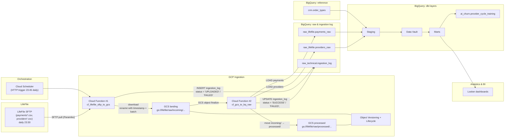

# Allia Health Group — Provider Churn / LifeFile Ingestion (Test Project)

This repository contains a small end-to-end data pipeline around **LifeFile payment / provider data** for Allia Health Group:

- Ingestion from **LifeFile SFTP** into **Google Cloud Storage (GCS)**.
- Loading **raw CSV** into **BigQuery raw** tables.
- Technical **ingestion log** with idempotency.
- Downstream modeling in **dbt** towards BI marts and an **AI-ready churn dataset**.

The focus is on **pipeline robustness, idempotency, and clear modeling** for provider churn analysis.


## 1. High-level architecture

### End-to-end data flow (LifeFile → GCS → BigQuery → BI/AI)


## 2. Ingestion layer: SFTP → GCS → BigQuery raw

### 2.1 Agreements with the LifeFile team

- LifeFile drops export files to SFTP **every day at 23:30 UTC**.
  If the export fails, they perform a **second attempt at 23:35 UTC**.
- Technical point of contact: **[X@email.com](mailto:X@email.com)**.
- A manual export can be triggered by LifeFile following the documented procedure (**{instructions}**).
- Each daily export contains **only new and updated records** for the current day, plus a **30-minute overlap from the previous day** to capture late updates.
- Files are kept on the LifeFile side for **1 month**.
- Files are delivered in **CSV** format, with names such as
  `provider_452271717.csv` and `payment_656463262.csv`.
- If there is no data, the file is downloaded empty.

### 2.2 Files structure


### 2.3 Cloud Function #1 — cf_lifefile_sftp_to_gcs

#### Purpose

 - Pull batch files from LifeFile SFTP once per day.

 - Store them in GCS landing as compressed CSV.

 - Write a row into raw_technical.ingestion_log for each SFTP file.

 - Guarantee idempotency on SFTP file level.

#### Trigger

- Cloud Scheduler (23:45 daily). LifeFile is responsible for producing SFTP exports daily around 23:30.

### 2.4 Cloud Function #2 — cf_gcs_to_bq_raw

#### Purpose

- Load CSV files from GCS landing into BigQuery raw tables

- Update raw_technical.ingestion_log with final load status (SUCCESS / FAILED).

- Move successfully loaded files into GCS processed.

#### Trigger

- GCS event: google.storage.object.finalize for objects in gs://<GCS_BUCKET_NAME>/raw/incoming/....

## 3. Ingestion log — raw_technical.ingestion_log

### DDL

```sql
CREATE TABLE IF NOT EXISTS raw_technical.ingestion_log (
  file_type       STRING,  -- 'payments', 'providers', etc.
  file_date       DATE,    -- logical file date (UTC) based on ingestion time or filename
  source_system   STRING,  -- 'lifefile'
  source_path     STRING,  -- full SFTP path, e.g. '/outgoing/payments_2025-11-15.csv'

  gcs_uri         STRING,  -- gs://bucket/raw/incoming/.../.csv.gz
  gcs_generation  INT64,   -- GCS object generation
  gcs_md5         STRING,  -- MD5 hash of object content (base64)
  gcs_size_bytes  INT64,   -- size of object in bytes

  target_dataset  STRING,  -- BigQuery dataset loaded ('raw_lifefile')
  target_table    STRING,  -- BigQuery table loaded ('payments_raw' / 'providers_raw')
  load_job_id     STRING,  -- BigQuery job id for load

  started_at      TIMESTAMP,  -- when SFTP→GCS ingestion started
  finished_at     TIMESTAMP,  -- when GCS→BQ load finished (or failed)

  status          STRING,  -- 'UPLOADED' | 'SUCCESS' | 'FAILED'
  error_message   STRING   -- error message in case of failure
);
```

4. Configuration (env vars & config.py)

Configuration for both Cloud Functions is centralized in config.py, which reads from environment variables provided by Cloud Functions / Cloud Run.

Key environment variables

Variable	Required	Default	Description
SFTP_HOST	✅	–	LifeFile SFTP host
SFTP_PORT	❌	22	SFTP port
SFTP_USERNAME	✅	–	SFTP username
SFTP_PASSWORD	✅	–	SFTP password (or key, ideally from Secret Manager)
SFTP_BASE_DIR	❌	/outgoing	Base directory on SFTP for LifeFile exports
SFTP_FILE_PATTERNS	❌	payments*.csv,providers*.csv	Comma-separated glob patterns for files to ingest
GCS_BUCKET_NAME	✅	–	GCS bucket used for raw/incoming and raw/processed
GCS_INCOMING_PREFIX	❌	raw/incoming	Prefix for landing (incoming) files
GCS_PROCESSED_PREFIX	❌	raw/processed	Prefix for successfully processed files
BQ_PROJECT	❌	default project	BigQuery project id
BQ_DATASET_ING	❌	raw_technical	Dataset for ingestion_log
BQ_TABLE_ING	❌	ingestion_log	Table for ingestion_log

config.py wraps these values into a Settings dataclass and exposes a single CONFIG object, which is imported by:

cf_lifefile_sftp_to_gcs

cf_gcs_to_bq_raw

5. Downstream modeling (dbt) — overview

The full implementation lives under /dbt (models, sources, tests, macros).
Below is a conceptual overview aligned with the architecture diagram.

5.1 Sources & staging

dbt sources:

raw_lifefile.payments_raw

raw_lifefile.providers_raw

crm.order_types (mapping of order_type → program_type / cycle_length)

Staging models (e.g. stg_lifefile__payments, stg_lifefile__providers):

Normalize field names and types.

Handle empty strings vs NULLs.

Apply basic quality checks (e.g. non-negative amounts where applicable).

Attach technical fields if needed (ingested_at, gcs_uri, etc.).

5.2 Data Vault layer (optional but shown in the diagram)

Hubs:

hub_provider — grain: 1 row per provider (prescriber / doctor).

hub_order — grain: 1 row per prescription / order.

hub_payment — grain: 1 row per payment event.

Links:

link_order_provider — relation between order and provider.

link_payment_order — relation between payment event and order.

Satellites:

sat_payment_financials — financial attributes per payment (copay_amount, insurance_amount, total_amount, cost_amount, profit_amount), modeled with SCD2 on payment_id + updated_at.

sat_payment_event — contextual attributes (payment_date, posting_date, status, payment_method, is_refund, etc.).

sat_provider_profile (potentially) — provider metadata and segmentation attributes.

This layer is optional for the exercise but demonstrates an extensible, business-agnostic core model.

5.3 Marts

fact_payment_events:

Grain: 1 row per payment event (per payment_id).

Joins:

provider (dim_provider),

order (dim_order / dim_program),

cycles from crm.order_types.

Fields:

payment and posting dates,

copay, insurance, total, cost, profit,

flags (refund, reversed, etc.),

attribution to program/cycle (3, 6, 9 months) where applicable.

fact_provider_cycles:

Grain: 1 row per provider × subscription cycle.

Includes:

cycle metadata: length (3/6/9 months), start/end dates,

financial metrics per cycle:

total revenue, total profit,

cost-to-serve proxy (e.g. support calls, marketing touches),

behavioral metrics:

number of prescriptions,

number of active months,

recency of last payment, etc.

These marts are the primary source for both BI segmentation in Looker and AI churn modeling.

6. BI & AI
6.1 Looker (BI layer)

Looker models (.lkml) are built on top of marts:

Example Explores:

provider_cycles_explore (based on fact_provider_cycles + dim_provider),

payments_explore (based on fact_payment_events).

Example dashboards:

Provider segmentation by:

program type (3/6/9-month),

monthly revenue and margin,

cost-to-serve buckets,

churn risk scores (from the ML model).

Cycle performance:

renewal vs non-renewal rates,

cohort retention by cycle start month,

average revenue and margin per active cycle.

6.2 AI-ready churn dataset (ai_churn.provider_cycle_training)

Grain: 1 row per provider × cycle.

Columns (examples):

provider_id

cycle_id / cycle_type (3/6/9-month)

Features over different windows (e.g. last 30/90/180 days):

revenue, margin, claims count,

number of prescriptions, days since last activity,

intensity of support / marketing interactions.

Churn label:

e.g. is_churned = 1 if provider did not renew within a defined grace period after cycle end,

otherwise 0.

This dataset is:

reproducible (built via SQL / dbt),

documented (feature dictionary),

ready for export to ML tooling (BigQuery ML, Vertex AI, or external pipelines).

