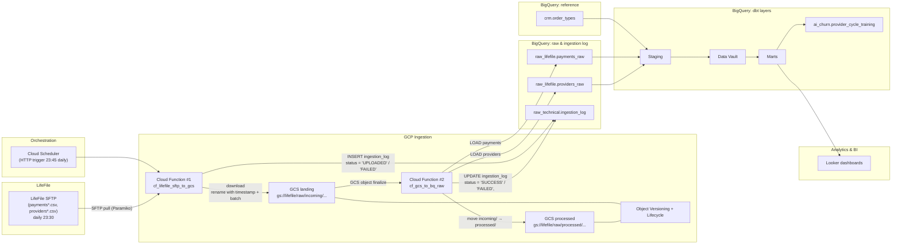
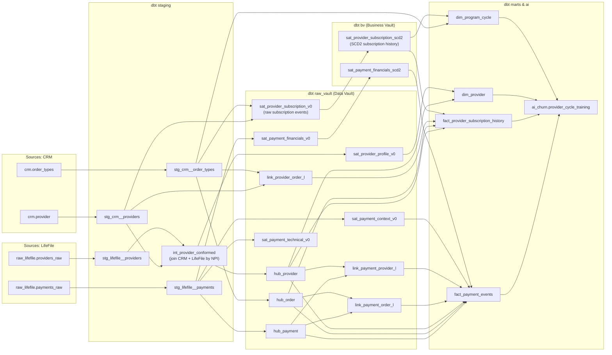

# Allia Health Group — Provider Churn / LifeFile Ingestion (Test Project)

This repository contains a small end-to-end data pipeline around **LifeFile payment / provider data** for Allia Health Group:

- Ingestion from **LifeFile SFTP** into **Google Cloud Storage (GCS)**.
- Loading **raw CSV** into **BigQuery raw** tables.
- Technical **ingestion log** with idempotency.
- Downstream modeling in **dbt** towards BI marts and an **AI-ready churn dataset**.

The focus is on **pipeline robustness, idempotency, and clear modeling** for provider churn analysis.


## 1. High-level architecture

### End-to-end data flow (LifeFile → GCS → BigQuery → BI/AI)


## 2. Ingestion layer: SFTP → GCS → BigQuery raw

### 2.1 Agreements with the LifeFile team

- LifeFile drops export files to SFTP **every day at 23:30 UTC**.
  If the export fails, they perform a **second attempt at 23:35 UTC**.
- Technical point of contact: **[X@email.com](mailto:X@email.com)**.
- A manual export can be triggered by LifeFile following the documented procedure (**{instructions}**).
- Each daily export contains **only new and updated records** for the current day, plus a **30-minute overlap from the previous day** to capture late updates.
- Files are kept on the LifeFile side for **1 month**.
- Files are delivered in **CSV** format, with names such as
  `provider_452271717.csv` and `payment_656463262.csv`.
- If there is no data, the file is downloaded empty.

### 2.2 Files structure
The file structure is described in **[dbt/models/staging/_src__aliia_health.yml](https://github.com/Cerega313/-Allia-Health-Group/blob/main/dbt/models/staging/_src__aliia_health.yml)**.
[Uploading lifefile_providers_raw_2025_10_11.csv…]()


### 2.3 Cloud Function #1 — cf_lifefile_sftp_to_gcs

#### Purpose

 - Pull batch files from LifeFile SFTP once per day.

 - Store them in GCS landing as compressed CSV.

 - Write a row into raw_technical.ingestion_log for each SFTP file.

 - Guarantee idempotency on SFTP file level.

#### Trigger

- Cloud Scheduler (23:45 daily). LifeFile is responsible for producing SFTP exports daily around 23:30.

### 2.4 Cloud Function #2 — cf_gcs_to_bq_raw

#### Purpose

- Load CSV files from GCS landing into BigQuery raw tables

- Update raw_technical.ingestion_log with final load status (SUCCESS / FAILED).

- Move successfully loaded files into GCS processed.

#### Trigger

- GCS event: google.storage.object.finalize for objects in gs://<GCS_BUCKET_NAME>/raw/incoming/....

## 3. Ingestion log — raw_technical.ingestion_log

### DDL

```sql
CREATE TABLE IF NOT EXISTS raw_technical.ingestion_log (
  file_type       STRING,  -- 'payments', 'providers', etc.
  file_date       DATE,    -- logical file date (UTC) based on ingestion time or filename
  source_system   STRING,  -- 'lifefile'
  source_path     STRING,  -- full SFTP path, e.g. '/outgoing/payments_2025-11-15.csv'

  gcs_uri         STRING,  -- gs://bucket/raw/incoming/.../.csv.gz
  gcs_generation  INT64,   -- GCS object generation
  gcs_md5         STRING,  -- MD5 hash of object content (base64)
  gcs_size_bytes  INT64,   -- size of object in bytes

  target_dataset  STRING,  -- BigQuery dataset loaded ('raw_lifefile')
  target_table    STRING,  -- BigQuery table loaded ('payments_raw' / 'providers_raw')
  load_job_id     STRING,  -- BigQuery job id for load

  started_at      TIMESTAMP,  -- when SFTP→GCS ingestion started
  finished_at     TIMESTAMP,  -- when GCS→BQ load finished (or failed)

  status          STRING,  -- 'UPLOADED' | 'SUCCESS' | 'FAILED'
  error_message   STRING   -- error message in case of failure
);
```

## 4. Trade-off: Postgres vs BigQuery

#### Workload and data profile
Postgres is a great fit for transactional and mixed workloads, but as you accumulate years of payment and provider history and start running complex analytical queries (year-level scans, multi-table joins), it tends to hit instance resource limits. BigQuery is designed as a columnar analytical warehouse and handles growing volumes and heavy analytics much more comfortably.

#### Infrastructure, operations and DevOps
Postgres requires instance management (sizing, HA, upgrades, tuning, reporting replicas). BigQuery is a serverless warehouse: scale, resilience and maintenance are handled by GCP, and the data team can focus on models, pipelines and data quality instead of database operations.

#### Cost
In a production scenario, Postgres costs grow in steps: as data and workload increase, you have to move to larger (and more expensive) instances, often with extra headroom “for the future”. BigQuery’s model is based on storage plus bytes actually scanned: for analytical workloads with peaks (reporting periods, ad-hoc analysis), this gives a more flexible and controllable TCO. With proper partitioning and clustering (e.g. by `payment_date` and `provider_id`), you can keep query costs under control without over-provisioning a large database cluster.

#### Analytics, BI and AI
BigQuery integrates natively with Looker: marts built in dbt can be exposed directly as BI-ready models for segmenting providers by cycle, revenue, cost-to-serve and profitability. On top of the same tables it’s easy to build the AI dataset (`ai_churn` schema) and feed it into BigQuery ML / Vertex AI / notebooks without extra copies or data movement. With Postgres, both BI and ML always live “outside” and require additional glue code and infrastructure.

#### Why BigQuery is the better choice for this project
For the provider churn use case in the SFTP → GCS → Cloud Functions → DWH → Looker → `ai_churn` stack, BigQuery provides a more cohesive and scalable solution:

- as data volumes grow, columnar storage and distributed execution in BigQuery allow much faster heavy aggregations and joins; at the current sample size performance is similar, but in production BigQuery delivers a real latency advantage;
- there is no database cluster to administer, and the system scales with the history of payments, providers and models;
- it fits naturally with dbt, Looker and the AI layer, enabling a single analytical environment in GCP without extra intermediary systems.

Therefore, for LifeFile + CRM analytics, BI dashboards and the churn training dataset, BigQuery is the natural choice for the main DWH, while Postgres can still be used (if needed) for transactional systems and operational microservices.


## 5. Downstream modeling (dbt) — overview

The full implementation lives under /dbt
Below is a conceptual overview aligned with the architecture diagram.

## dbt model lineage (CRM & LifeFile → Raw Vault → Business Vault → Marts → ai_churn)


