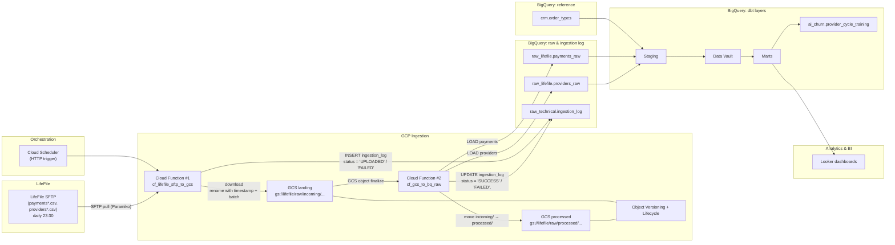
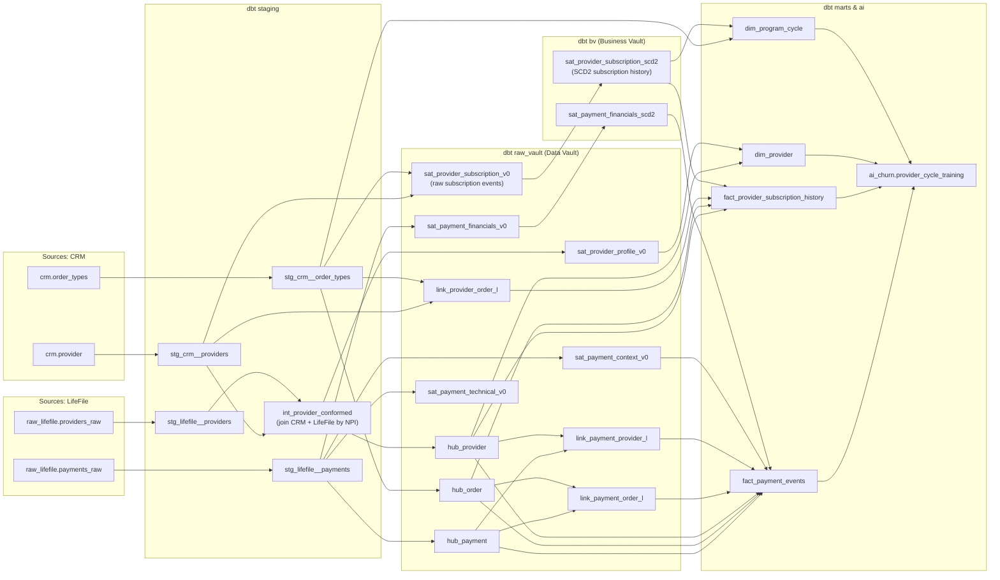

# Allia Health Group — Provider Churn / LifeFile Ingestion (Test Project)

This repository contains a small end-to-end data pipeline around **LifeFile payment / provider data** for Allia Health Group:

- Ingestion from **LifeFile SFTP** into **Google Cloud Storage (GCS)**.
- Loading **raw CSV** into **BigQuery raw** tables.
- Technical **ingestion log** with idempotency.
- Downstream modeling in **dbt** towards BI marts and an **AI-ready churn dataset**.

The focus is on **pipeline robustness, idempotency, and clear modeling** for provider churn analysis.


## 1. High-level architecture

### End-to-end data flow (LifeFile → GCS → BigQuery → BI/AI)


## 2. Ingestion layer: SFTP → GCS → BigQuery raw

### 2.1 Agreements with the LifeFile team

- LifeFile drops export files to SFTP **every day at 23:30 UTC**.
  If the export fails, they perform a **second attempt at 23:35 UTC**.
- Technical point of contact: **[X@email.com](mailto:X@email.com)**.
- A manual export can be triggered by LifeFile following the documented procedure (**{instructions}**).
- Each daily export contains **only new and updated records** for the current day, plus a **30-minute overlap from the previous day** to capture late updates.
- Files are kept on the LifeFile side for **1 month**.
- Files are delivered in **CSV** format, with names such as
  `provider_452271717.csv` and `payment_656463262.csv`.
- If there is no data, the file is downloaded empty.

### 2.2 Files structure
The file structure is described in **[dbt/models/staging/_src__aliia_health.yml](https://github.com/Cerega313/-Allia-Health-Group/blob/main/dbt/models/staging/_src__aliia_health.yml)**.


### 2.3 Cloud Function #1 — cf_lifefile_sftp_to_gcs

#### Purpose

 - Pull batch files from LifeFile SFTP once per day.

 - Store them in GCS landing as compressed CSV.

 - Write a row into raw_technical.ingestion_log for each SFTP file.

 - Guarantee idempotency on SFTP file level.

#### Trigger

- Cloud Scheduler (23:45 daily). LifeFile is responsible for producing SFTP exports daily around 23:30.

### 2.4 Cloud Function #2 — cf_gcs_to_bq_raw

#### Purpose

- Load CSV files from GCS landing into BigQuery raw tables

- Update raw_technical.ingestion_log with final load status (SUCCESS / FAILED).

- Move successfully loaded files into GCS processed.

#### Trigger

- GCS event: google.storage.object.finalize for objects in gs://<GCS_BUCKET_NAME>/raw/incoming/....

## 3. Ingestion log — raw_technical.ingestion_log

### DDL

```sql
CREATE TABLE IF NOT EXISTS raw_technical.ingestion_log (
  file_type       STRING,  -- 'payments', 'providers', etc.
  file_date       DATE,    -- logical file date (UTC) based on ingestion time or filename
  source_system   STRING,  -- 'lifefile'
  source_path     STRING,  -- full SFTP path, e.g. '/outgoing/payments_2025-11-15.csv'

  gcs_uri         STRING,  -- gs://bucket/raw/incoming/.../.csv.gz
  gcs_generation  INT64,   -- GCS object generation
  gcs_md5         STRING,  -- MD5 hash of object content (base64)
  gcs_size_bytes  INT64,   -- size of object in bytes

  target_dataset  STRING,  -- BigQuery dataset loaded ('raw_lifefile')
  target_table    STRING,  -- BigQuery table loaded ('payments_raw' / 'providers_raw')
  load_job_id     STRING,  -- BigQuery job id for load

  started_at      TIMESTAMP,  -- when SFTP→GCS ingestion started
  finished_at     TIMESTAMP,  -- when GCS→BQ load finished (or failed)

  status          STRING,  -- 'UPLOADED' | 'SUCCESS' | 'FAILED'
  error_message   STRING   -- error message in case of failure
);
```

## 4. Trade-off: Postgres vs BigQuery

#### Workload and data profile
Postgres is a great fit for transactional and mixed workloads, but as you accumulate years of payment and provider history and start running complex analytical queries (year-level scans, multi-table joins), it tends to hit instance resource limits. BigQuery is designed as a columnar analytical warehouse and handles growing volumes and heavy analytics much more comfortably.

#### Infrastructure, operations and DevOps
Postgres requires instance management (sizing, HA, upgrades, tuning, reporting replicas). BigQuery is a serverless warehouse: scale, resilience and maintenance are handled by GCP, and the data team can focus on models, pipelines and data quality instead of database operations.

#### Cost
In a production scenario, Postgres costs grow in steps: as data and workload increase, you have to move to larger (and more expensive) instances, often with extra headroom “for the future”. BigQuery’s model is based on storage plus bytes actually scanned: for analytical workloads with peaks (reporting periods, ad-hoc analysis), this gives a more flexible and controllable TCO. With proper partitioning and clustering (e.g. by `payment_date` and `provider_id`), you can keep query costs under control without over-provisioning a large database cluster.

#### Analytics, BI and AI
BigQuery integrates natively with Looker: marts built in dbt can be exposed directly as BI-ready models for segmenting providers by cycle, revenue, cost-to-serve and profitability. On top of the same tables it’s easy to build the AI dataset (`ai_churn` schema) and feed it into BigQuery ML / Vertex AI / notebooks without extra copies or data movement. With Postgres, both BI and ML always live “outside” and require additional glue code and infrastructure.

#### Why BigQuery is the better choice for this project
For the provider churn use case in the SFTP → GCS → Cloud Functions → DWH → Looker → `ai_churn` stack, BigQuery provides a more cohesive and scalable solution:

- as data volumes grow, columnar storage and distributed execution in BigQuery allow much faster heavy aggregations and joins; at the current sample size performance is similar, but in production BigQuery delivers a real latency advantage;
- there is no database cluster to administer, and the system scales with the history of payments, providers and models;
- it fits naturally with dbt, Looker and the AI layer, enabling a single analytical environment in GCP without extra intermediary systems.

Therefore, for LifeFile + CRM analytics, BI dashboards and the churn training dataset, BigQuery is the natural choice for the main DWH, while Postgres can still be used (if needed) for transactional systems and operational microservices.

## 5. Downstream modeling (dbt) — overview

The full implementation lives under /dbt
Below is a conceptual overview aligned with the architecture diagram.

## dbt model lineage (CRM & LifeFile → Raw Vault → Business Vault → Marts → ai_churn)



## 6. ai_churn.provider_cycle_train

### DDL

```sql

-- ai_churn schema and training table
CREATE SCHEMA IF NOT EXISTS ai_churn ;

CREATE TABLE IF NOT EXISTS ai_churn.provider_cycle_train (
  --------------------------------------------------------
  -- 1. Key
  --------------------------------------------------------
  provider_id                 STRING    NOT NULL, -- provider / prescriber ID (from LifeFile/CRM)
  npi                         STRING    NOT NULL, -- National Provider Identifier (where available)

  --------------------------------------------------------
  -- 3. Geo
  --------------------------------------------------------
  state                       STRING,            
  city                        STRING,

  --------------------------------------------------------
  -- 4. Onboarding
  --------------------------------------------------------

  provider_onboard_date       DATE,              -- first time provider started any program with Allia
  provider_tenure_days        INT64,

  --------------------------------------------------------
  -- 5. Current Program / subscription
  --------------------------------------------------------
  program_id                  STRING,            -- ref to program table
  cycle_length_months         INT64,             -- 3 / 6 / 9
  cycle_start_date            DATE,
  cycle_end_date              DATE,
  cycle_start_month           DATE,
  cycle_end_month             DATE,
  grace_period_days           INT64,             -- allowed days to renew after cycle_end_date
  days_in_cycle               INT64,            -- cycle_end_date - cycle_start_date
  cycle_number_for_provider   INT64,            -- 1st, 2nd, 3rd, ... cycle for this provider

  days_since_cycle_start      INT64,            -- snapshot_date - cycle_start_date
  days_to_cycle_end           INT64,            -- cycle_end_date - snapshot_date
  is_in_grace_period          BOOL,             -- snapshot_date between cycle_end_date and cycle_end_date+grace
  current_subscription_status STRING,           -- 'ACTIVE', 'PAUSED', 'EXPIRED', 'CANCELLED', etc.
  days_since_freeze           INT64,

  --------------------------------------------------------
  -- 6. Previous Program / subscription
  --------------------------------------------------------
  prior_churn_events_count    INT64,             -- how many times this provider churned historically (before current cycle)
  has_prior_churn             BOOL,              -- convenience flag (prior_churn_events_count > 0)
  has_previous_cycle          BOOL,             -- provider had at least one cycle before this one

  previous_cycle_length_months INT64,
  previous_cycle_profit_total NUMERIC,          -- total profit in previous cycle
  previous_cycle_churned      BOOL,             -- previous cycle ended with churn/long gap or natural renewal

  --------------------------------------------------------
  -- 7. Payments & revenue: lifetime aggregates
  --------------------------------------------------------
  lifetime_orders_count       INT64,            -- all orders across all time for this provider
  lifetime_payments_count     INT64,            -- all payment events
  lifetime_revenue_total      NUMERIC,          -- sum(total_amount)
  lifetime_profit_total       NUMERIC,          -- sum(profit_amount)
  lifetime_refund_amount      NUMERIC,          -- sum(total_amount) for refund rows
  lifetime_refund_count       INT64,
  lifetime_profit_margin_pct  FLOAT64,          -- lifetime_profit_total / NULLIF(lifetime_revenue_total, 0)
  lifetime_avg_order_value    NUMERIC,          -- lifetime_revenue_total / NULLIF(lifetime_orders_count, 0)

  lifetime_copay_share_pct    FLOAT64,          -- sum(copay_amount) / sum(total_amount)
  lifetime_insurance_share_pct FLOAT64,         -- sum(insurance_amount) / sum(total_amount)

  --------------------------------------------------------
  -- 8. Payments & revenue: current cycle aggregates
  --------------------------------------------------------
  cycle_orders_count          INT64,            -- number of orders in current cycle
  cycle_payments_count        INT64,            -- number of payment events in current cycle
  cycle_revenue_total         NUMERIC,          -- sum(total_amount) in current cycle
  cycle_profit_total          NUMERIC,          -- sum(profit_amount) in current cycle
  cycle_profit_margin_pct     FLOAT64,          -- cycle_profit_total / NULLIF(cycle_revenue_total, 0)

  cycle_copay_total           NUMERIC,          -- sum(copay_amount)
  cycle_insurance_total       NUMERIC,          -- sum(insurance_amount)
  cycle_copay_share_pct       FLOAT64,          -- cycle_copay_total / NULLIF(cycle_revenue_total, 0)
  cycle_insurance_share_pct   FLOAT64,          -- cycle_insurance_total / NULLIF(cycle_revenue_total, 0)

  cycle_refund_amount         NUMERIC,          -- refunds in current cycle
  cycle_refund_count          INT64,

  cycle_avg_order_value       NUMERIC,          -- cycle_revenue_total / NULLIF(cycle_orders_count, 0)
  cycle_avg_profit_per_order  NUMERIC,          -- cycle_profit_total / NULLIF(cycle_orders_count, 0)

  days_since_last_order       INT64,            -- snapshot_date - last_order_date
  last_order_date             DATE,

  avg_days_between_orders_lifetime INT64,       -- average gap between orders (lifetime)
  avg_days_between_orders_180d     INT64,       -- average gap over last 180 days
  stddev_days_between_orders_180d  FLOAT64,     -- variability in ordering pattern (volatility)
  has_gap_over_60d_without_orders  BOOL,        -- any 60+ day gap in last 6–12 months

  --------------------------------------------------------
  -- 9. Payments & revenue: recent windows (recency & trend)
  --    All windows are relative to snapshot_date and only include data BEFORE it.
  --------------------------------------------------------
  payments_30d_count          INT64,
  payments_60d_count          INT64,
  payments_90d_count          INT64,

  revenue_30d_total           NUMERIC,
  revenue_60d_total           NUMERIC,
  revenue_90d_total           NUMERIC,

  profit_30d_total            NUMERIC,
  profit_60d_total            NUMERIC,
  profit_90d_total            NUMERIC,

  refunds_90d_count           INT64,
  refunds_90d_amount          NUMERIC,

  revenue_trend_3m_vs_prev3m  FLOAT64,          -- (revenue_last_3m - revenue_prev_3m) / NULLIF(revenue_prev_3m, 0)
  orders_trend_3m_vs_prev3m   FLOAT64,

  --------------------------------------------------------
  -- 10. Engagement – CRM (Creatio) interactions
  --------------------------------------------------------
  crm_last_contact_date       DATE,
  days_since_last_crm_contact INT64,            -- snapshot_date - crm_last_contact_date

  crm_interactions_30d_count  INT64,            -- any CRM activity: calls, meetings, emails, tasks
  crm_interactions_90d_count  INT64,
  crm_interactions_180d_count INT64,

  crm_meetings_90d_count      INT64,
  crm_emails_90d_count        INT64,
  crm_calls_logged_90d_count  INT64,

  crm_open_tasks_count        INT64,            -- open tasks at snapshot_date
  crm_overdue_tasks_count     INT64,            -- overdue tasks for this provider

  has_recent_successful_meeting BOOL,           -- TRUE if there was a meeting in last N days
  has_recent_failed_renewal_conversation BOOL,  -- derived from CRM tags (if available)

  --------------------------------------------------------
  -- 11. Engagement – Call center signals
  --------------------------------------------------------
  cc_last_call_date           DATE,
  days_since_last_call        INT64,

  cc_calls_inbound_30d_count  INT64,
  cc_calls_inbound_90d_count  INT64,
  cc_calls_outbound_30d_count INT64,
  cc_calls_outbound_90d_count INT64,

  cc_avg_call_duration_90d_sec FLOAT64,
  cc_total_call_duration_90d_sec INT64,

  cc_calls_with_issue_tag_90d_count INT64,      -- calls tagged as issue/complaint
  cc_calls_retention_script_90d_count INT64,    -- calls where renewal/retention script was used
  cc_calls_successful_renewal_90d_count INT64,  -- calls leading to renewal/upsell

  --------------------------------------------------------
  -- 12. Mix & penetration of programs
  --------------------------------------------------------
  total_cycles_for_provider   INT64,            -- how many cycles total this provider had
  distinct_programs_count     INT64,            -- number of distinct programs used by this provider
  is_single_program_provider  BOOL,             -- provider only ever used one program
)
PARTITION BY snapshot_date
CLUSTER BY provider_id, cycle_end_date ;
```


## 7. Looker Dashboards - sketchily

 **[LookML directory](https://github.com/Cerega313/-Allia-Health-Group/tree/main/LookML)**


